# City Hydration Flow - Complete Documentation

## 📖 Overview

The **City Hydration System** automatically populates the database with POIs (Points of Interest) from **Overture Maps** when a user requests places near a location. The system ensures atomic processing, prevents duplicates, and maintains data quality through multiple validation stages.

---

## 🎯 Trigger Points

### 1. Edge Function: `places-nearby`

**Location:** `supabase/functions/places-nearby/index.ts`

**When Triggered:**

- User opens the app near a new city
- User searches for places in an area
- Called by: Frontend → `GET /functions/v1/places-nearby?lat=X&lng=Y`

**What It Does:**

```typescript
1. Receives lat/lng from user
2. Calls RPC: check_and_lock_city_for_hydration(lat, lng)
3. If city needs hydration:
   → Dispatches GitHub Actions workflow
4. Returns existing places (if any)
```

### 2. GitHub Actions Workflow

**Location:** `.github/workflows/hydrate-city.yml`

**Trigger:** Repository dispatch from `places-nearby`

**Payload:**

```json
{
  "event_type": "hydrate-city",
  "client_payload": {
    "lat": -25.4,
    "lng": -49.24
  }
}
```

---

## 🔄 Complete Hydration Flow

```mermaid
flowchart TD
    Start([User Opens App]) --> EdgeFunc[Edge Function: places-nearby]

    EdgeFunc --> CheckCity{City Exists?}

    CheckCity -->|No| Discovery[City Discovery RPC<br/>Find/Create City Record]
    CheckCity -->|Yes| LockCity[RPC: check_and_lock_city]

    Discovery -->LockCity

    LockCity --> NeedsHydration{Needs Hydration?}

    NeedsHydration -->|No<br/>Fresh/Processing| ReturnPlaces[Return Existing Places]
    NeedsHydration -->|Yes| Dispatch[Dispatch GitHub Workflow]

    Dispatch --> Python[Python Script: hydrate_overture_city.py]

    Python --> DuckDB[Query Overture via DuckDB]

    DuckDB --> Filter1{Filter 1: Confidence >= 0.5<br/>Operating Status = open}
    Filter1 -->|Reject| End1[❌ Rejected]
    Filter1 -->|Pass| Filter2{Filter 2: Category Mapped?}

    Filter2 -->|No mapping| End2[❌ Rejected: unmapped_category]
    Filter2 -->|Mapped| Sanitize[Sanitize Name]

    Sanitize --> Filter3{Filter 3: Name Valid?}
    Filter3 -->|Empty/Blacklist| End3[❌ Rejected: empty_name]
    Filter3 -->|Valid| AIMatch[AI Matcher: Hotlist Generation]

    AIMatch --> Validation[Validation Pipeline]

    Validation --> Val1{Validate Category+Name}
    Val1 -->|Fail| End4[❌ Rejected: validate_name]
    Val1 -->|Pass| Val2{Check Taxonomy}

    Val2 -->|Forbidden| End5[❌ Rejected: taxonomy]
    Val2 -->|Pass| Val3{OSM Red Flags?}

    Val3 -->|Has flags| End6[❌ Rejected: osm_flags]
    Val3 -->|Clean| Score[Calculate Scores]

    Score --> ScoreFilter{Score Valid?<br/>confidence >= 0.5 if no online}
    ScoreFilter -->|Fail| End7[❌ Rejected: score]
    ScoreFilter -->|Pass| Dedup[Simple Exact Deduplication]

    Dedup --> Batch[Batch Processing<br/>10,000 POIs per batch]

    Batch --> Staging[INSERT to staging_places]

    Staging --> Merge[SQL: merge_staging_to_production]

    Merge --> InsertNew[INSERT new places]
    Merge --> UpdateExisting[UPDATE existing places]
    Merge --> SoftDelete[Soft DELETE missing places<br/>Only on final batch]

    InsertNew --> Sources1[INSERT to place_sources]
    UpdateExisting --> Sources2[UPDATE place_sources]

    Sources1 --> Complete[✅ Hydration Complete]
    Sources2 --> Complete
    SoftDelete --> Complete

    Complete --> UpdateCity[Update city status to 'completed']

    UpdateCity --> EndSuccess([🎉 Success])
    ReturnPlaces --> EndSuccess
```



---

## 📋 Stage-by-Stage Breakdown

### Stage 1: Edge Function Trigger

**File:** `supabase/functions/places-nearby/index.ts`

```typescript
// Check if city needs hydration
const { data } = await supabase.rpc("check_and_lock_city_for_hydration", {
  p_lat: lat,
  p_lng: lng,
});

if (data?.should_hydrate) {
  // Dispatch GitHub workflow
  await fetch("https://api.github.com/repos/.../dispatches", {
    method: "POST",
    body: JSON.stringify({
      event_type: "hydrate-city",
      client_payload: { lat, lng },
    }),
  });
}
```

**SQL RPC:**

```sql
-- Atomic check + lock
FOR UPDATE; -- Row-level lock prevents concurrent hydrations
IF city.status = 'processing' OR city.updated_at > NOW() - INTERVAL '60 days':
  RETURN should_hydrate = FALSE;
ELSE:
  UPDATE cities SET status = 'processing';
  RETURN should_hydrate = TRUE;
```

---

### Stage 2: Python Processing Pipeline

**File:** `scripts/hydrate_overture_city.py`

#### 2.1 DuckDB Query (Overture Maps)

```python
# Query Overture with predicate pushdown
query = f"""
SELECT
  id, names.primary, categories.primary,
  ST_AsWKB(geometry), addresses, confidence, ...
FROM read_parquet('s3://overturemaps-us-west-2/...')
WHERE
  bbox.xmin >= {bbox[0]} AND bbox.xmax <= {bbox[2]}
  AND bbox.ymin >= {bbox[1]} AND bbox.ymax <= {bbox[3]}
  AND confidence >= 0.5
  AND categories.primary IS NOT NULL
  AND (operating_status IS NULL OR operating_status = 'open')
"""

pois = con.execute(query).fetchall()
```

**Filters at Source:**

- ✅ BBox (city boundaries)
- ✅ Confidence >= 0.5
- ✅ Operating status = 'open'
- ✅ Has category

#### 2.2 Early Filtering (Pre-AI Matching)

```python
for row in batch_pois:
    # Filter 1: Category mapping
    overture_cat = row[POIColumn.OVERTURE_CATEGORY]
    internal_cat = category_map.get(overture_cat)
    if not internal_cat:
        early_rejected['unmapped_category'] += 1
        continue

    # Filter 2: Sanitize name
    raw_name = row[POIColumn.NAME]
    sanitized_name = sanitize_name(raw_name, config)
    if not sanitized_name:
        early_rejected['empty_name'] += 1
        continue
```

**Category Mapping Examples:**

```json
{
  "bar": "bar",
  "brewery": "bar",
  "restaurant": "restaurant",
  "park": "park"
}
```

#### 2.3 AI Matching (Hotlist)

```python
# Generate hotlist with OpenAI GPT-5.2
hotlist = generate_hotlist(city_name)

# Pre-filter candidates (fuzzy matching)
candidates = find_candidates_for_iconic(iconic_name, all_pois, category)

# AI validation (GPT-4o-mini as semantic judge)
matches = ai_validate_matches_batch(validation_batch)
# Marks POIs as iconic → +100 relevance bonus
```

#### 2.4 Validation Pipeline

```python
# Validation 1: Category vs Name consistency
if not validate_category_name(name, category, original_category, config):
    debug_rejected['validate_name'] += 1
    continue

# Validation 2: Taxonomy hierarchy
if not check_taxonomy_hierarchy(category_tags, overture_cat, alternates, config):
    debug_rejected['taxonomy'] += 1
    continue

# Validation 3: OSM red flags
if filter_osm_red_flags(category_tags, config):
    debug_rejected['osm_flags'] += 1
    continue
```

#### 2.5 Scoring

```python
score_result = calculate_scores(
    confidence, websites, socials, street, house_number,
    source_magnitude, has_brand, is_iconic, config
)

if not score_result:
    debug_rejected['score'] += 1
    continue
```

**Score Components:**

```
base (5) + website (10) + social (15) + high_confidence (5)
+ house_number (5) + neighborhood (3) + street (2)
+ source_magnitude_3plus (30) + brand_authority (20)
+ dual_presence (20) + iconic_bonus (100)
```

#### 2.6 Simple Exact Deduplication

```python
# Create dedup key
dedup_key = (
    normalize_text(name),
    normalize_text(street),
    normalize_text(house_number)
)

# Group by key → select winner (highest completeness_score)
winner = max(group, key=lambda p: completeness_score(p))
```

**Result:** 13,507 → 13,499 (8 exact duplicates removed)

---

### Stage 3: SQL Merge to Production

**File:** `supabase/migrations/20260116000007_fix_soft_delete_logic.sql`

#### 3.1 Batch INSERT to Staging

```sql
INSERT INTO staging_places (name, category, geom, ...)
VALUES (...);
```

#### 3.2 Merge Staging to Production

```sql
-- INSERT new places
INSERT INTO places SELECT ... FROM staging_places
WHERE NOT EXISTS (lat/lng correlation match);

-- UPDATE existing places
UPDATE places SET ... FROM staging_places
WHERE lat/lng match;
```

#### 3.3 Place Sources (Provenance)

```sql
INSERT INTO place_sources (place_id, provider, external_id)
SELECT place_id, 'overture', sp.overture_id FROM staging_places;
```

#### 3.4 Soft Delete (Final Batch)

```sql
UPDATE places SET active = false
WHERE updated_at < execution_start - INTERVAL '1 hour'
  AND within city bbox;
```

---

## 📊 Example Statistics

```
City: Curitiba
DuckDB: 87,040 POIs → 13,507 after filters
Python: 13,507 → 12,511 after validation
Result: 12,511 POIs in database
AI Matched: 75 iconic venues
Duration: ~3 minutes
```

---

## 🔒 Key Safety Features

✅ **Row-Level Lock** - Prevents concurrent hydrations  
✅ **Timestamp Marking** - Prevents premature soft delete  
✅ **Lat/Lng Correlation** - Prevents duplicates  
✅ **Soft Delete** - Can reactivate POIs  
✅ **Non-Destructive** - All Overture IDs preserved

---

## 📁 Key Files

- [hydrate_overture_city.py](file:///Users/rafael/workspace/bumpti/scripts/hydrate_overture_city.py)
- [deduplication.py](file:///Users/rafael/workspace/bumpti/scripts/hydration/deduplication.py)
- [scoring.py](file:///Users/rafael/workspace/bumpti/scripts/hydration/scoring.py)
- [validation.py](file:///Users/rafael/workspace/bumpti/scripts/hydration/validation.py)
- [ai_matcher.py](file:///Users/rafael/workspace/bumpti/scripts/hydration/ai_matcher.py)
- [categories.json](file:///Users/rafael/workspace/bumpti/config/curation/categories.json)

**Status:** Production-ready 🚀
