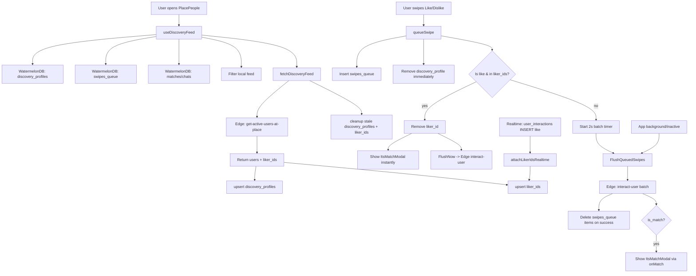

# Discovery Swipe Flow

This document describes the local-first discovery feed, swipe queue, and instant match flow.

## Overview

The feed is cached locally in WatermelonDB and filtered against local swipes and matches.
Swipes are queued locally, batched, and synced to the edge in the background.
Instant match is triggered when the user likes someone who already liked them.

## Data model (WatermelonDB)

- `discovery_profiles`
  - `id` (user_id)
  - `raw_data` (serialized profile)
  - `place_id`
  - `last_fetched_at`
- `swipes_queue`
  - `target_user_id`
  - `action` ("like" | "dislike")
  - `place_id`
  - `created_at`
- `liker_ids`
  - `id` (user_id)

## Flow diagram

## Key behaviors

- **Local-first feed:** `useDiscoveryFeed` reads from `discovery_profiles` and filters any ID
  present in `swipes_queue`, `matches`, or `chats`.
- **Optimistic UX:** swipes are queued locally and the profile is removed from
  `discovery_profiles` immediately.
- **Micro-batching:** swipes are batched for 2 seconds before sending to the edge.
- **Instant match:** if a liked user exists in `liker_ids`, the modal opens immediately and the
  queue flushes in background.
- **Realtime support:** new likes arriving via `user_interactions` are inserted into `liker_ids`
  to enable instant match without a refresh.
- **Cache cleanup (24h):** stale `discovery_profiles` are removed by `last_fetched_at`. The
  `liker_ids` set is cleared if the last fetch timestamp is older than 24 hours.

## Architecture references

- Feed + cache: `hooks/use-discovery-feed.ts`, `modules/discovery/discovery-service.ts`
- Swipe queue + batching: `hooks/use-discovery-swipes.ts`, `modules/discovery/swipe-queue-service.ts`
- Liker IDs store + realtime: `modules/discovery/liker-ids-service.ts`, `modules/discovery/realtime.ts`
- Instant match UI: `components/its-match-modal.tsx`, `app/(modals)/place-people.tsx`
- Edge endpoints: `supabase/functions/get-active-users-at-place/index.ts`, `supabase/functions/interact-user/index.ts`

## Edge endpoints

- `get-active-users-at-place` returns `{ users, liker_ids }`.
- `interact-user` accepts `{ batch: [...] }` and returns per-item `is_match`.
